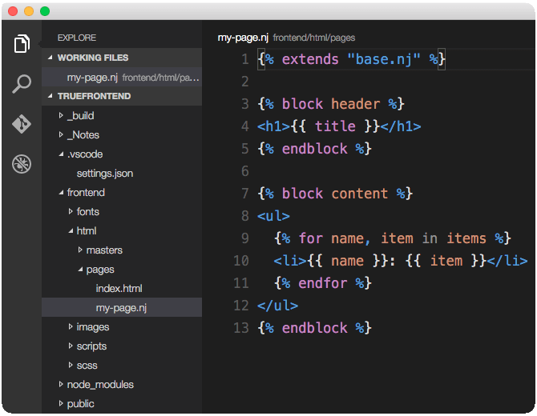

#vscode-nunjucks
A Nunjucks syntax definition specifically for **VS Code**.

## Install your extension
1. To start using this extension with Visual Studio Code copy it into the <user home>/.vscode/extensions folder.
2. Restart the Code app.

## What's in the folder
* This folder contains all of the files necessary for the vscode-nunjucks extension
* `package.json` - this is the manifest file in which the language support is declared and the location of the grammar file that has been copied into the extension is defined.
* `syntaxes/nunjucks.tmLanguage` - this is the Text mate grammar file that is used for tokenization
* `nunjucks.configuration.json` - this the language configuration, defining the tokens that are used for comments and brackets.

### For more information
* [Visual Studio Code Docs](https://code.visualstudio.com/docs)
* [Nunjucks by Mozilla](https://mozilla.github.io/nunjucks/)

### Credits
Based on [Sublime-nunjucks](https://github.com/mogga/sublime-nunjucks)