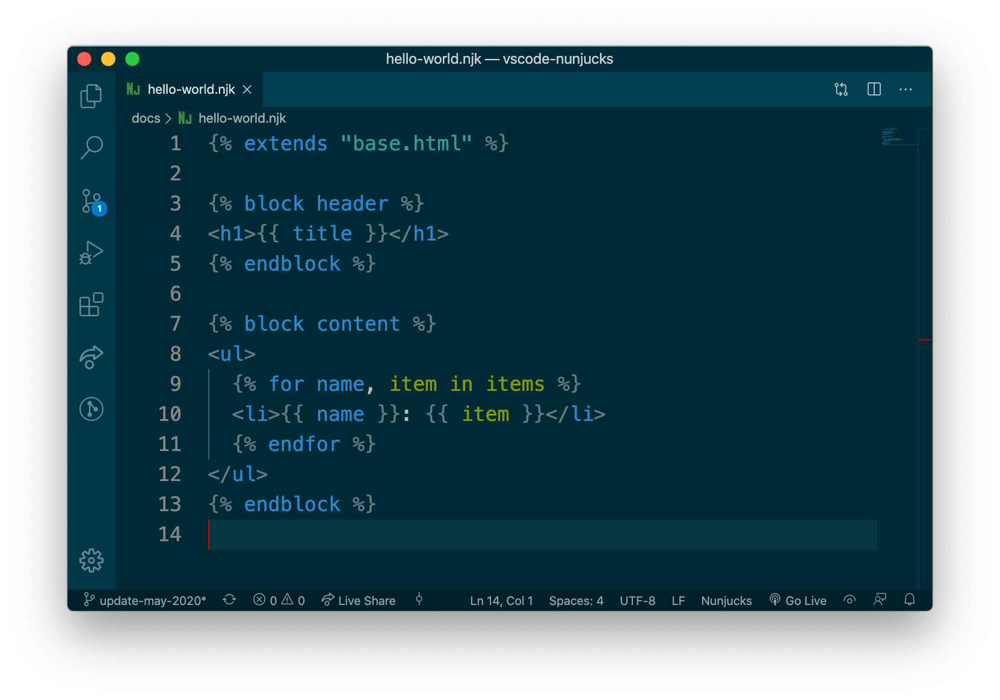

# Nunjucks for Visual Studio Code
Nunjucks template syntax definition with snippets for **Microsoft Visual Studio Code**.

> ### New update March 9. 2022 (version 0.3.1)

## vscode-nunjucks support these file extensions
```
.njk, .nj, .nunjucks
```

Although you are free to use any file extension you wish for your Nunjucks template files, the Nunjucks community has adopted `.njk`



### For more information
* [Visual Studio Code Docs](https://code.visualstudio.com/docs)
* [Nunjucks by Mozilla](https://mozilla.github.io/nunjucks/)

### Credits
This extension is based on the [Sublime-nunjucks](https://github.com/mogga/sublime-nunjucks) language file. Latest release is based on pullrequests from 

### Contributers
[github.com/ronnidc/vscode-nunjucks/graphs/contributors](https://github.com/ronnidc/vscode-nunjucks/graphs/contributors)