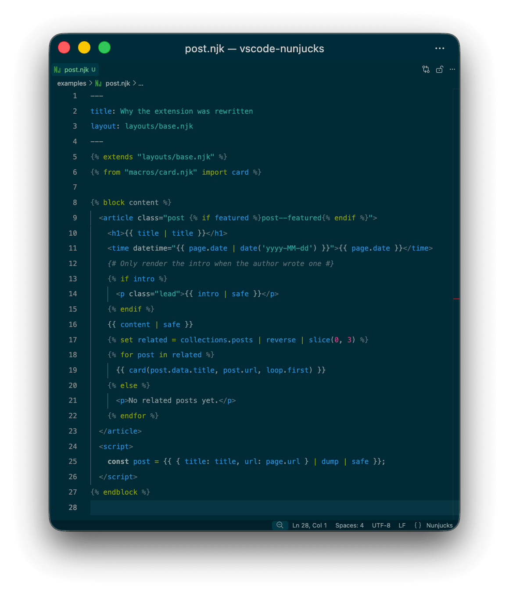

# Nunjucks for Visual Studio Code

Full editor support for [Nunjucks](https://mozilla.github.io/nunjucks/) templates: syntax highlighting, HTML IntelliSense, Emmet, formatting and snippets, in `.njk` files and in vscode.dev.

[](https://marketplace.visualstudio.com/items?itemName=ronnidc.nunjucks)
[](https://marketplace.visualstudio.com/items?itemName=ronnidc.nunjucks)
[](https://marketplace.visualstudio.com/items?itemName=ronnidc.nunjucks&ssr=false#review-details)
[](https://open-vsx.org/extension/ronnidc/nunjucks)
[](https://github.com/ronnidc/vscode-nunjucks/actions/workflows/ci.yml)



## Features

- **Syntax highlighting built on VS Code's own HTML grammar.** Nunjucks tags, expressions, filters, tests, comments and whitespace control are highlighted everywhere they can appear: in markup, inside attribute values, inside `<script>` and `<style>` blocks, and in inline styles. `` and `` blocks are left alone.
- **HTML IntelliSense.** Tag and attribute completion, hover documentation, auto-closing and auto-renaming of tags, matching tag highlighting, document outline and folding, straight from VS Code's HTML language server. CSS and JavaScript inside `<style>` and `<script>` get their own completion too.
- **Emmet.** Abbreviations such as `ul>li*3` expand in Nunjucks files out of the box.
- **Formatting that understands templates.** Format Document keeps ``, `{{ }}` and multi-line `{# #}` blocks intact instead of folding them into one line.
- **Front matter.** A YAML, `---js` or `---json` block at the top of the file is highlighted as YAML, JavaScript or JSON, the way Eleventy and other static site generators expect.
- **Comment toggling that follows the cursor.** `Ctrl+/` or `Cmd+/` gives `{# #}` in markup, `//` inside `<script>` and `/* */` inside `<style>`.
- **Smart indentation.** Pressing Enter between `<div></div>` or between `` indents the way it does in HTML.
- **Auto-closing delimiters.** Typing `{{`, `{%` or `{#` inserts the closing pair with the cursor in the middle.
- **Snippets** for every Nunjucks tag, see the table below.
- **Works everywhere.** No native code and no build step, so the extension runs in VS Code desktop, vscode.dev, github.dev and remote workspaces.

## Install

Search for **Nunjucks** by ronnidc in the Extensions view, or run

```
code --install-extension ronnidc.nunjucks
```

VSCodium and other Open VSX based editors: [open-vsx.org/extension/ronnidc/nunjucks](https://open-vsx.org/extension/ronnidc/nunjucks).

## File extensions

`.njk`, `.nunjucks`, `.nunj` and `.nj` open as Nunjucks. The Nunjucks community and Eleventy use `.njk`.

The extension deliberately does not take over `.html` files, so plain HTML keeps its own comments, IntelliSense and formatter. If your templates are `.html` files, associate them yourself in `settings.json`, for the whole workspace or for one folder:

```json
"files.associations": {
  "*.html": "nunjucks",
  "src/_includes/**/*.html": "nunjucks"
}
```

## Settings

The extension changes two VS Code defaults so that the features above work without configuration. Both are ordinary settings you can override.

| Setting | Default set by this extension | Why |
| --- | --- | --- |
| `emmet.includeLanguages` | `{ "nunjucks": "html" }` | Enables Emmet in Nunjucks files. If you already define this object yourself, add the `"nunjucks": "html"` entry to it, VS Code does not merge the two. |
| `html.format.templating` | `true` | Makes the HTML formatter honour ``, `{{ }}` and `{# #}` instead of reflowing them. |

Everything else is inherited from your HTML settings. For example, to format Nunjucks files on save:

```json
"[nunjucks]": {
  "editor.formatOnSave": true
}
```

## Snippets

| Prefix | Expands to |
| --- | --- |
| `if`, `ifelse`, `elif`, `else` | `` blocks and branches |
| `for`, `forelse` | `` loop, with an `` branch for empty collections |
| `asyncEach`, `asyncAll` | asynchronous loops |
| `macro`, `call` | `` definition and `` block |
| `set`, `setblock` | `` and the block form `...` |
| `filter` | `` block |
| `extends`, `block`, `include`, `includeignore`, `import`, `from` | template inheritance and composition |
| `raw`, `verbatim` | blocks that are not parsed as Nunjucks |
| `comment`, `commentblock` | `{# #}` on one or several lines |
| `var`, `super`, `caller`, `loop` | `{{ }}`, `{{ super() }}`, `{{ caller() }}` and `loop.` properties |

## Using it with Eleventy

Nunjucks is the most used template language in [Eleventy](https://www.11ty.dev/), and the extension is tested against Eleventy style templates: front matter at the top, `` layouts, `` partials and shortcodes. Shortcodes and other custom tags are highlighted as tags even though the extension cannot know their names.

## Troubleshooting

**Emmet does not expand.** You probably have your own `emmet.includeLanguages` in `settings.json`, which replaces the default. Add `"nunjucks": "html"` to it.

**Format Document puts tags on one line.** Check that `html.format.templating` is not set to `false` in your settings. Formatting is done by VS Code's HTML formatter, so the `html.format.*` settings apply.

**HTML IntelliSense stopped working after installing another extension.** Extensions that replace the built-in HTML language features, or file associations that map `.njk` to another language, take precedence. Check the language mode in the status bar, it should say Nunjucks.

**Custom tag delimiters** (`nunjucks.configure({ tags: ... })`) are not supported yet, the grammar assumes `{{ }}`, `` and `{# #}`. Follow [#36](https://github.com/ronnidc/vscode-nunjucks/issues/36).

Found something else? [Open an issue](https://github.com/ronnidc/vscode-nunjucks/issues/new/choose).

## Contributing

Bug reports, feature requests and pull requests are welcome. See [CONTRIBUTING.md](https://github.com/ronnidc/vscode-nunjucks/blob/main/CONTRIBUTING.md) for how to run the extension and its tests locally, and [CHANGELOG.md](https://github.com/ronnidc/vscode-nunjucks/blob/main/CHANGELOG.md) for what changed in each release.

## Credits

Versions 0.1 to 0.3 (2015 to 2022) were a port of the [Sublime-nunjucks](https://github.com/mogga/sublime-nunjucks) language file, Copyright (c) 2012-2015 Mogga, released under the BSD-2-Clause license. None of that code remains in 1.0, which was rewritten from scratch in 2026 on top of VS Code's own HTML grammar. Thanks to everyone who [contributed](https://github.com/ronnidc/vscode-nunjucks/graphs/contributors) or reported issues along the way.

[MIT licensed](https://github.com/ronnidc/vscode-nunjucks/blob/main/LICENSE).
